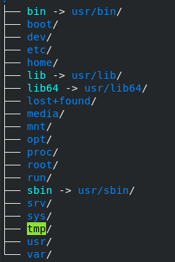

# Linux基础（Fedora 28 x86_64）

# 1.shell基础 
## 1.1 命令补全键 

TAB 键
## 1.2 bash常用快捷键 

|功能|快捷键|
|:--|:--:|
|查看上一条指令| ctrl+p/up|
|查看下一条指令| ctrl+n/down|
|光标左移|ctrl+b|
|光标右移|ctrl+f|
|光标移动到开头|ctrl+a/Home|
|光标移动到末尾|ctrl+e/End|
|清屏|ctrl+l|
|删除光标所在字符|ctrl+d|
|删除光标前面的字符|ctrl+h|
|删除光标前面的所有字符|ctrl+u|
|删除光标后面的所有字符|ctrl+k|
|重复执行当前指令|ctrl+o|
|中断当前指令|ctrl+c|
# 2.分区/目录 
## 2.1 分区 

一块硬盘：主分区+扩展分区<=4

主分区可以直接使用，扩展必须二次分区为逻辑分区才可使用
```shell
    sudo fdisk -l
```
现在基本都是scsi，sata，use硬盘

常见分区约定:

* 主分区：sda1,sda2

* 扩展分区：sda3

* 逻辑分区：永远从sda5开始
## 2.2 目录  



```shell

. 代表当前目录

... 代表上级目录

~ 代表用户目录路径
```

# 3.常用命令 
|命令|功能|
|:----|----:|
|ls -ld dir/|查看dir目录的属性信息|
|stat| 查看文件的属性信息(同一分区inode唯一) |
|mkdir| create a new directory |
|rmdir| delete a exists directory |
|cat| |
|more| |
|less| |
|locate| |
|grep| |
|find / -name "*.c" \| xargs grep stdio.h | |
|find / -name "*.c" \|wc -l||
|find / -name "*.c" -exec wc -l {} \ ||
|od (octal dump) |od -tx1 foo.c|
|du(disk usage)| 计算目录在磁盘中所占空间大小，默认kb为单位|
|df(disk free)| 磁盘使用情况 |
|find / -name "*.c" > /dev/null 2>&1|标准输出，标准错误重定向到无底洞文件|
|&|让程序在后台执行|
|awk '{print $1 $2}' /proc/meminfo||
|awk -F '/' '{print $3}' ../data/urls||
|lsb_release -a||
|uname -a||


关闭桌面环境(略)

# 4.用户管理 
## 4.1 当前用户 
```shell
whoami
```
## 4.2 所有用户信息 
```shell
cat /etc/passwd
```
## 4.3 查看用户在哪些组里面 
```shell
groups [user] #如果不填写user，代表当前用户所在的组
```
## 4.4 查看组里面有哪些用户 
```shell
cat /etc/group
```
## 4.5 su&sudo 
su:switch user

```shell
su root #切换到root用户
sudo passwd root #修改root密码
```
## 4.6 创建用户与修改密码 
useradd

```shell
sudo useradd xiaoming -s /bin/bash -g xiaoming -m

    -s #指定新用户登陆是shell类型
    -g #指定所属组,该组必须已经存在，不指定的时候自动创建一个与用户名重名的用户组
    -d #指定用户目录，该目录必须存在
    -m #用户目录不存在时，自动创建该目录

sudo passwd xiaoming #设置xiaoming的密码
```
## 4.7 创建用户组 
```shell
groupadd [group]
```
## 4.8 组管理 
```shell
usermod -a -G [group1,group2...] [user]#给用户添加组
gpasswd -a [user] [group]#给用户添加组
gpasswd -d [user] [group]#从用户组删除用户
groupmod -n [newgroup] [oldgroup]#给用户组改名
```
## 4.9 删除用户 
```shell
deluser --remove-home [user]
```
## 4.10 删除用户组 
```shell
groupdel [group]
```
# 5. 文件属性
umask 0002

777

666
```
chmod 
chown
```
非目录

-r 无法查看文件内容

-w 无法修改文件内容

-x 无法执行可执行二进制文件

目录

-r 能对此目录有列表功能，就是可以执行ls命令进行查看，另外还有cp的功能

-w 在此目录下创建文件和目录，可以通过touch，mkdir等命令创建文件和目录，另外还可以删除此目录下的文件

-x 能进入此目录，利用cd等命令进入此目录

# 6. 压缩包管理 
sudo dnf install rar unrar
```
tar -czvf | -xzvf -C /path/to/dir #tar.gz
tar -cjvf | -xjvf -C /path/to/dir #tar.gz.bz2
rar a -r myrar.rar mydir
unrar x myrar.rar
zip -r mydir.zip mydir
unzip mydir.zip
tar -xvJf node-v10.2.0-linux-x64.tar.xz 
```
# 7. 软件安装(略) 
# 8. 网络管理 
```shell
ifconfig enp0s25 192.168.30.233(临时更改)
```
设置静态ip
```shell

```
修改dns
```shell
sudo vim /etc/resolv.conf
nameserver 8.8.8.8
```
ping

netstat
```
-a #显示所有socket，包括正在监听的
-c #每隔1s就重新显示一遍，直到用户中断它
-n #以网路ip地址代替名称,显示网络连接情况，显示端口
-t #显示tcp协议的连接情况
-u #显示udp协议的连接情况
-p #显示建立相关链接的程序名
-l #查看正在处于监听状态的程序
#listen和listening的状态只有-a和-l才能看到
```
常用组合
```
sudo netstat -apn
```

# 9. 进程管理 
```shell
ps -axu -ef
jobs -l -p -r -s
fg 
kill -9 2357
top
```
# 10. 环境变量 
```shell
sudo vim ~/.bashrc 
sudo vim /etc/profile
    export PATH=$PATH:/path/to/file
LIBRARY_PATH #用于在程序编译期间查找动态链接库时指定查找共享库的路径
LD_LIBRARY_PATH #用于在程序加载运行期间查找动态链接库时指定除了系统默认路径之外的其他路径
C_INCLUDE_PATH #指明c头文件的搜索路径
CPLUS_INCLUDE_PATH  #指明c++头文件的搜索路径
```