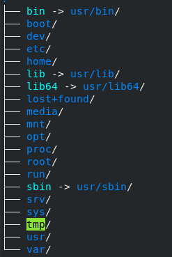

# Linux 基础使用 #
(Based on Fedora 28 x86_64)

# 1.shell基础 #
## 1.1 命令补全键 ##

TAB 键
## 1.2 bash常用快捷键 ##

|功能|快捷键|
|:--|:--:|
|查看上一条指令| ctrl+p/up|
|查看下一条指令| ctrl+n/down|
|光标左移|ctrl+b|
|光标右移|ctrl+f|
|光标移动到开头|ctrl+a/Home|
|光标移动到末尾|ctrl+e/End|
|清屏|ctrl+l|
|删除光标所在字符|ctrl+d|
|删除光标前面的字符|ctrl+h|
|删除光标前面的所有字符|ctrl+u|
|删除光标后面的所有字符|ctrl+k|
|重复执行当前指令|ctrl+o|
|中断当前指令|ctrl+c|
# 2.分区/目录 #
## 2.1 分区 ##

一块硬盘：主分区+扩展分区<=4

主分区可以直接使用，扩展必须二次分区为逻辑分区才可使用
```shell
    sudo fdisk -l
```
现在基本都是scsi，sata，use硬盘

常见分区约定:

* 主分区：sda1,sda2

* 扩展分区：sda3

* 逻辑分区：永远从sda5开始
## 2.2 目录  ##



```shell

. 代表当前目录

... 代表上级目录

~ 代表用户目录路径
```

# 3.常用命令 #
|命令|功能|
|:----|----:|
|ls -ld dir/|查看dir目录的属性信息|
|stat| 查看文件的属性信息 |
|mkdir| create a new directory |
|rmdir| delete a exists directory |
|cat| |
|more| |
|less| |
|locate| |
|find| |
|grep| |
|wc| |
|od| |
|du| |
|df| |

